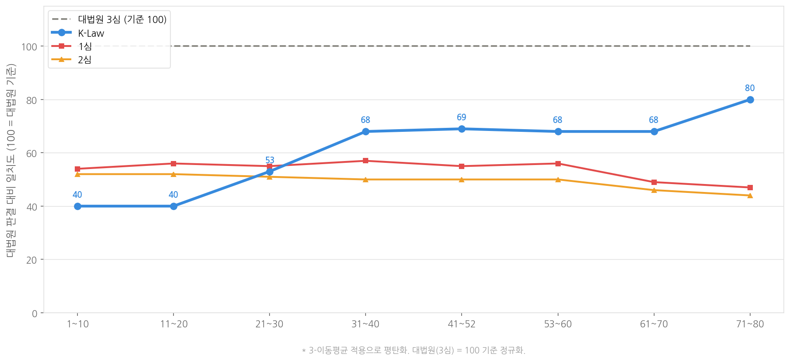
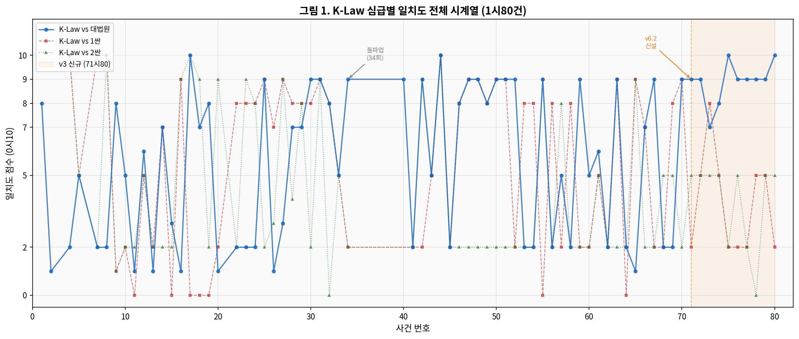
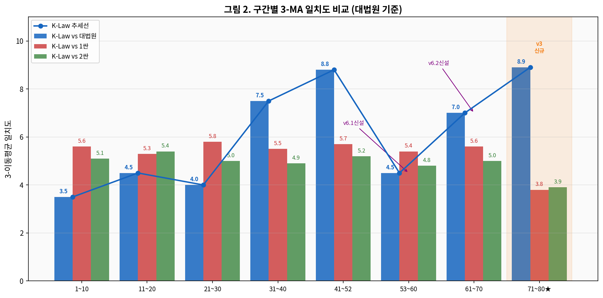
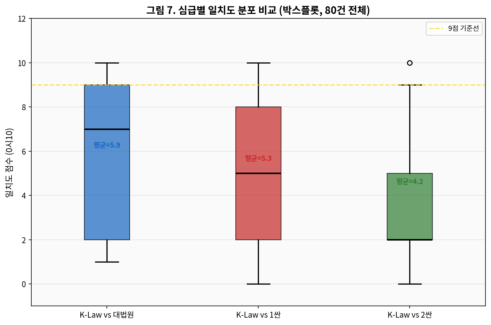
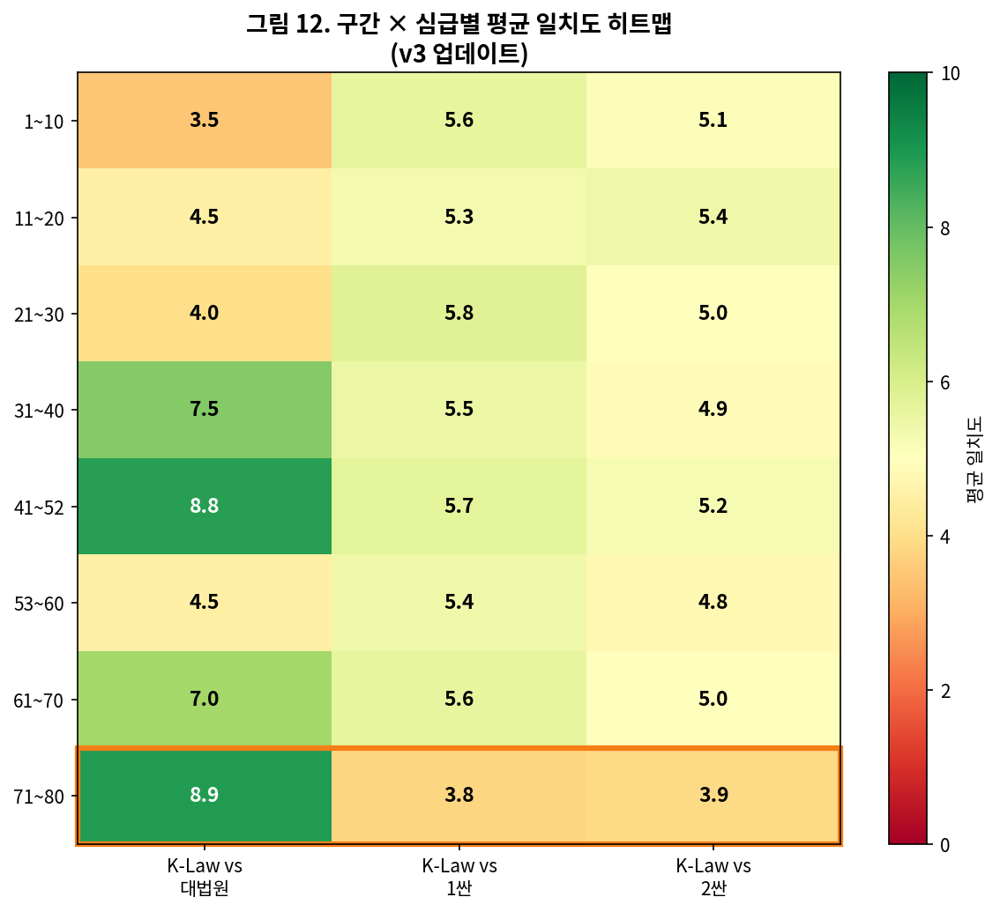
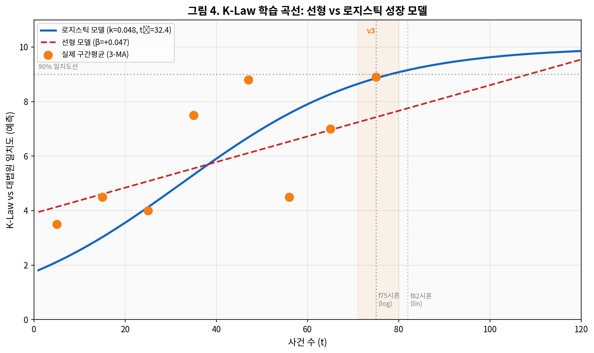
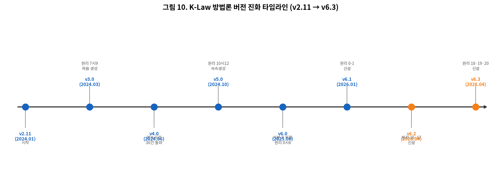

# K-Law — AI 기반 법률 중재 보조 시스템
> ## 🏛️ K-Law AI 가상 법원 — 지금 바로 체험하기
> **[▶ https://jejuro.github.io/k-law/)**
>
> AI가 K-Law 방법론으로 분석하는 가상 법원을 직접 체험해 보세요.
> 사건 정보를 입력하면 DeepSeek R1이 법리를 분석하여 가상 판결을 도출합니다.
> 별도 설치 없이 브라우저에서 즉시 실행됩니다.

---

> **"빈부격차없이 평등하고 공정하게 보호받는 사회"**

## AI 법원 시뮬레이션

> **"K-Law 방법론"으로 여러분이 직접 AI 법원을 만들어 보고, 그 성능을 평가해 보세요.**

- AI 법원을 만드는 방법론
- AI 법원의 성능을 평가하는 방법론
- 여러분이 만든 AI 법원을 활용하는 방법론

K-Law는 대한민국 헌법·법률·대법원 판례를 기반으로, AI를 활용하여 분쟁 사건의 법리를 분석하고 중재인의 독립적 판단을 보조하는 **오픈소스 법률 중재 방법론**입니다.

- **입력**: 분쟁 당사자 간 합의된 사실관계 (A4 0.5~1장)
- **출력**: 법리 분석 보고서 + 예상 판결 방향 + 초등학생도 이해할 수 있는 해설
- **소요 시간**: 1~5분
- **비용**: 5만~50만원/건 (법원 소송 대비 수십분의 1)
- **검증**: 80건의 실제 대법원 판결과 비교 완료 (v6.3 기준)

---

## 목차 (Table of Contents)

- [성능 — 1심·2심 법원 대비 K-Law](#성능--1심2심-법원-대비-k-law)
  - [전체 일치도 추세 비교](#전체-일치도-추세-비교-3-이동평균-평탄화-대법원--100-기준)
  - [구간별 3-이동평균 일치도 비교](#구간별-3-이동평균-일치도-비교)
  - [심급별 일치도 분포 및 빈도](#심급별-일치도-분포-및-빈도)
  - [학습 곡선 및 버전 진화](#학습-곡선-및-버전-진화)
- [K-Law 성능을 직접 확인하는 방법](#k-law-성능을-직접-확인하는-방법)
  - [1단계 — 대법원 판결문 수집](#1단계--대법원-판결문-수집)
  - [2단계 — 판결문 전문 저장](#2단계--판결문-전문-저장)
  - [3단계 — 사건 실체 추출](#3단계--사건-실체-추출-llm-1차)
  - [4단계 — 사건 실체 보완](#4단계--사건-실체-보완-llm-2차)
  - [5단계 — Mandatory Execute 실행](#5단계--k-law-mandatory-execute-실행)
  - [6단계 — K-Law 가상 판결 생성](#6단계--k-law-가상-판결-생성-다른-llm)
  - [7단계 — 일치도 평가](#7단계--일치도-평가)
  - [8단계 — 결과 확인](#8단계--결과-확인)
- [방법론 갱신 자동화](#방법론-갱신-자동화)
  - [전체 파이프라인](#전체-파이프라인)
  - [갱신 트리거 기준](#갱신-트리거-기준)
  - [4-ALL 원칙 — 갱신안 검증](#4-all-원칙--갱신안-검증)
- [저장소 구조](#저장소-구조)
- [법적 근거](#법적-근거)
- [오픈소스 철학](#오픈소스-철학)
- [인용](#인용)
- [라이선스](#라이선스)
- [면책조항](#면책조항-disclaimer)

---

## 성능 — 1심·2심 법원 대비 K-Law

K-Law의 가상 판결은 1심·2심 실제 판결보다 대법원 최종 판결에 현저히 더 가깝습니다.

### 전체 일치도 추세 비교 (3-이동평균 평탄화, 대법원 = 100 기준)



> K-Law(파랑)는 초기 35점에서 89점까지 지속 상승하며 대법원(100)을 향해 수렴. 1심·2심은 55점 내외 수평 유지.

<table>
<tr>
<td align="center" width="50%">
<a href="research/charts/chart_timeseries.png">

</a>
<sub>심급별 일치도 전체 시계열 (80건)</sub>
</td>
<td align="center" width="50%">
<a href="research/charts/chart_3ma.png">

</a>
<sub>구간별 3-이동평균 일치도 비교</sub>
</td>
</tr>
</table>

---

### 구간별 3-이동평균 일치도 비교

| 구간 | K-Law vs 대법원 | K-Law vs 1심 | K-Law vs 2심 |
|------|:--------------:|:------------:|:------------:|
| 1~10 | 3.5 | 5.6 | 5.1 |
| 31~40 | 7.5 | 5.5 | 5.0 |
| 41~52 | **8.8** | 5.7 | 5.2 |
| **71~80** | **8.9** | 3.8 | 3.9 |

> 초기 3.5점에서 최근 구간 8.9점으로 지속 상승. 1심·2심은 정체된 반면 K-Law는 학습을 통해 지속적으로 개선됩니다.

---

### 심급별 일치도 분포 및 빈도

| 비교 대상 | 평균 일치도 |
|----------|:----------:|
| **K-Law vs 대법원** | **5.9** |
| K-Law vs 1심 | 5.3 |
| K-Law vs 2심 | 4.2 |

<table>
<tr>
<td align="center" width="50%">
<a href="research/charts/chart_boxplot.png">

</a>
<sub>심급별 일치도 분포 박스플롯 (80건 전체)</sub>
</td>
<td align="center" width="50%">
<a href="research/charts/chart_histogram.png">

</a>
<sub>심급별 일치도 점수 빈도 분포</sub>
</td>
</tr>
</table>

> K-Law vs 대법원(파랑)은 8~10점 구간에 집중. 1심·2심은 0~5점 구간에 편중.

---

### 학습 곡선 및 버전 진화

<table>
<tr>
<td align="center" width="50%">
<a href="research/charts/chart_learning.png">

</a>
<sub>학습 곡선 — 로지스틱 성장 모델</sub>
</td>
<td align="center" width="50%">
<a href="research/charts/chart_timeline.png">

</a>
<sub>버전 진화 타임라인 (v2.11 → v6.3)</sub>
</td>
</tr>
</table>

> 로지스틱 성장 모델(k=0.048)에 따르면 90% 일치도(9점) 달성은 약 75건 시점으로 예측됩니다.

| 버전 | 시기 | 주요 변경 |
|------|------|-----------|
| v2.11 | 2024.01 | 시작 |
| v3.0 | 2024.03 | 원리 7·9 추가 |
| v4.0 | 2024.06 | 30건 돌파 |
| v5.0 | 2024.10 | 원리 10·12 속속 생성 |
| v6.0 | 2025.06 | 원리 0·6 추가 |
| v6.1 | 2026.01 | 원리 0-1 신설 |
| v6.2 | 2026.04 | 원리 18·19·20 신설 |
| **v6.3** | **2026.04** | **현재** |

---

## K-Law 성능을 직접 확인하는 방법

K-Law의 성능(법리의 완전성, 공정성 등)은 **누구나 아래 절차로 직접 검증**할 수 있습니다.

---

### 1단계 — 대법원 판결문 수집

대법원 판결문 공개 사이트에서 원하는 사건을 검색합니다.

예) 민사 손해배상 사건 검색:

```
https://portal.scourt.go.kr/pgp/index.on?m=PGP1011M01&l=N&c=900&q=%EC%86%90%ED%95%B4%EB%B0%B0%EC%83%81
```

- 원하는 사건의 **대법원 판결문**을 열고, 좌측 하단의 **고등법원 판결문 링크** 클릭 → 별도 탭에서 열림
- 고등법원 판결문 좌측 하단의 **지방법원 판결문 링크** 클릭 → 별도 탭에서 열림

---

### 2단계 — 판결문 전문 저장

지방법원·고등법원·대법원 판결문을 모두 복사하여 메모장에 붙여넣기 후 저장합니다.

```
파일명 예시: 전문.txt
```

---

### 3단계 — 사건 실체 추출 (LLM 1차)

원하는 LLM(예: Google Gemini)에 `전문.txt`를 첨부한 뒤 다음 프롬프트를 입력합니다.

```
판결 및 판결을 암시하는 내용을 모두 배제하고,
사건의 실체와 원고/피고의 주장을 상세히 기술하십시오.
```

---

### 4단계 — 사건 실체 보완 (LLM 2차)

3단계 답변을 복사해 프롬프트에 붙여넣고, 아래 내용을 추가 입력합니다.

```
더욱 상세히 기술하되, 판결 또는 판결을 암시하는 내용을 배제하십시오.
```

---

### 5단계 — K-Law Mandatory Execute 실행

4단계 출력을 복사하여, 이 저장소의 **`V6.3-MANDATORY-EXECUTE`** 문서 내 지정된 위치에 붙여넣습니다.

> ⚠️ Mandatory Execute 문서의 버전은 지속적으로 업데이트됩니다. 현재 기준: **v6.3 (2026년 4월 14일)**

---

### 6단계 — K-Law 가상 판결 생성 (다른 LLM)

Mandatory Execute 문서 전체를 복사하여, **다른 LLM**(예: DeepSeek)의 프롬프트에 붙여넣고, 이 저장소의 **`K-Law 판결 방법론 v6.4.docx`** 문서를 첨부한 뒤 실행합니다.

> 방법론 문서 버전은 지속적으로 업데이트됩니다.

---

### 7단계 — 일치도 평가

2단계에서 저장한 `전문.txt`를 동일 LLM 프롬프트에 첨부하고 다음을 입력합니다.

```
첨부한 문서는 실제 1심, 2심, 3심 판결문입니다.
K-Law의 가상 판결과 대법원(3심) 판결 간의 일치도를 0~10단계로 평가하십시오
(0 = 완전 불일치, 10 = 완전 일치).
평가는 항목별로 나눠 진행하세요.
또한, 1심과 2심 각각에 대해서도 3심 판결과의 일치도를 점수로 평가하십시오.
특히, 대법원 판결을 기준으로 K-Law, 1심, 2심 점수를 항목별로 분석하고,
최종 점수를 표로 작성해야 합니다.
마지막으로, 방법론 갱신 필요성 여부를 판단하십시오.
방법론은 추상적·보편적·일반적 법 원칙이어야 하며, 개별 사건에 매몰되면 안 됩니다.
```

---

### 8단계 — 결과 확인

K-Law 가상 판결, 1심 판결, 2심 판결 중 **어느 것이 대법원 최종 판결에 가장 근접한지** 직접 확인합니다.

---

> **참고**: 위의 Gemini·DeepSeek은 실시 예일 뿐이며, 어떤 LLM을 사용하든 결과는 유사합니다. 다만 LLM 간에 약간의 성능 차이가 있습니다.

---

## 방법론 갱신 자동화

K-Law 방법론은 대법원 판결문 데이터를 기반으로 자동 갱신됩니다. 상세 내용은 [`K-Law_방법론_갱신_자동화_v1.0.docx`](methodology/K-Law_방법론_갱신_자동화_v1.0.docx)를 참조하십시오.

### 전체 파이프라인

```
[법제처 API] → [수집] → [심급 연계] → [분류] → [K-Law 가상 판결] → [평가] → [방법론 갱신]
      ↑                                                                              ↓
      └─────────────────── 피드백 루프 (갱신된 방법론 반영) ────────────────────────┘
```

| 단계 | 모듈 | 내용 |
|------|------|------|
| 1 | 수집·심급 연계 | 법제처 API로 대법원 판결문 수집 후 1심·2심 역추적 (3단계 폴백 매칭) |
| 2 | 자동 분류 | 사건명 패턴 → 키워드 빈도 → LLM 분류 (민사·형사·가사·행정) |
| 3 | 가상 판결 생성 | LLM 독립적 표준 프롬프트 3단계로 K-Law 가상 판결 도출 |
| 4 | 자동 평가 | 일치도 평가 기준 v1.1 자동 적용 (결론·법리·논증·근거 각 항목별 점수화) |
| 5 | 갱신 트리거 판단 | 임계값 초과 시 자동 갱신 절차 개시 |
| 6 | 갱신안 생성·검증 | 4-ALL 원칙으로 추상성 검증 후 방법론 버전 업데이트 |

---

### 갱신 트리거 기준

| 트리거 | 조건 | 조치 |
|--------|------|------|
| 단일 사건 저점 | K-Law 점수 ≤ 5점 | 해당 분류 갱신 검토 개시 |
| 이동평균 하락 | 최근 10건 평균 1점 이상 하락 | 즉시 갱신 절차 개시 |
| 분류별 평균 미달 | 특정 분류 평균 점수 < 6점 | 해당 분류 방법론 재작성 |
| 플래그 비율 초과 | 갱신 필요 플래그 비율 > 30% | 전체 방법론 재검토 |

---

### 4-ALL 원칙 — 갱신안 검증

갱신안의 각 원리는 아래 **4가지를 모두** 충족해야 승인됩니다. 하나라도 미충족 시 반려 후 재작성합니다.

| 검증 기준 | 내용 |
|----------|------|
| **보편성** | 동일 유형의 모든 사건에 적용 가능한가 |
| **추상성** | 특정 사건의 당사자명·금액·날짜 등 사실관계에 의존하지 않는가 |
| **독립성** | 기존 원리 0~20과 중복되거나 충돌하지 않는가 |
| **검증가능성** | 해당 원리의 적용 결과가 대법원 판례로 검증 가능한가 |

---

## 저장소 구조

```
k-law/
├── README.md                                    # 이 파일
├── LICENSE                                      # GPL-3.0
│
├── methodology/                                 # K-Law 방법론
│   ├── V6.3-MANDATORY-EXECUTE.docx             # 필수 실행 문서 (최신 버전)
│   ├── K-Law-판결방법론-v6.4.docx              # 판결 방법론 전문
│   └── K-Law_방법론_갱신_자동화_v1.0.docx     # 방법론 갱신 자동화 설계서
│
├── research/                                    # 연구 자료
│   ├── K-Law-논문-v5-한국어.docx              # 검증 논문
│   └── charts/                                  # 성능 차트 이미지
│
└── data/                                        # 검증 데이터
    └── validation-results-v3.csv               # 80건 일치도 평가 결과
```

---

## 법적 근거

K-Law는 **중재법 제8조**에 따른 서면 중재합의를 기반으로 운영됩니다.

- AI는 중재인 **보조 도구**로만 기능하며, 최종 판정은 자연인 변호사 중재인이 독립적으로 내림
- 헌법 제27조(재판청구권)와 충돌하지 않는 **임의적 분쟁 해결 절차**

---

## 오픈소스 철학

> "판결 방법론을 공개하는 것은 약점이 아니라 가장 강력한 신뢰 구축 수단이다."

K-Law의 모든 방법론은 공개됩니다. 누구나 성능을 직접 검증할 수 있어야 하며, 그것이 신뢰의 기반입니다.

---

## 인용

```
K-Law Team. (2026). K-Law: AI-Assisted Legal Arbitration Methodology (v6.3).
https://github.com/team-jupeter/k-law
```

---

## 라이선스

GPL-3.0 — 자유롭게 사용·수정·배포 가능하나, 파생 저작물도 동일 라이선스를 유지해야 합니다.

---

## 면책조항 (Disclaimer)

본 저장소에 공개된 K-Law 방법론, 논문, 데이터, 코드 및 모든 관련 자료는 **순수한 학술 연구 및 기술 검증 목적**으로 제공됩니다.

### 법률 자문 아님
K-Law 시스템의 출력 결과는 AI 알고리즘에 의한 **참고용 법리 분석**이며, 대한민국 변호사법상 법률 자문, 법률 의견서, 또는 공식적인 법적 판단에 해당하지 않습니다. 본 시스템의 분석 결과를 실제 법적 분쟁의 근거로 단독 사용하는 것을 권장하지 않으며, 구체적인 법적 문제에 대해서는 반드시 자격을 갖춘 법률 전문가의 조언을 구하시기 바랍니다.

### 연구 목적 한계
본 저장소의 성능 검증 데이터(80건)는 특정 사건 유형 및 기간을 대상으로 한 연구 표본이며, 모든 법률 분야 및 사건 유형에 대한 일반화를 보증하지 않습니다. 연구 결과는 K-Law 방법론의 지속적인 개선을 위한 중간 단계의 실증 데이터로 이해되어야 합니다.

### 정확성 보증 없음
K-Law의 법리 분석은 대법원 판결과의 일치도 향상을 목표로 하고 있으나, 모든 사건에 대해 정확한 결과를 보증하지 않습니다. AI 시스템의 특성상 오류·편향·누락이 발생할 수 있으며, 이로 인한 직·간접적 손해에 대해 개발자 및 케이로주식회사(K-Law Inc.)는 책임을 지지 않습니다.

### 지속적 업데이트
본 방법론 및 관련 문서는 연구 진행에 따라 예고 없이 수정·변경될 수 있습니다. 특정 버전의 문서에 의존하는 경우, 해당 버전의 커밋 해시를 명시하여 참조하시기 바랍니다.

### 제3자 도구 사용
본 검증 절차에서 예시로 언급된 Google Gemini, DeepSeek 등 제3자 LLM 서비스의 사용은 해당 서비스의 이용약관 및 개인정보처리방침에 따릅니다. 제3자 서비스 이용으로 인한 결과에 대해 케이로주식회사는 책임을 지지 않습니다.

> 본 저장소의 자료를 연구·교육 목적으로 활용하실 경우, 출처를 명시하여 인용하여 주시기 바랍니다.  
> `K-Law Team. (2026). K-Law: AI-Assisted Legal Arbitration Methodology (v6.3). https://github.com/team-jupeter/k-law`

---
